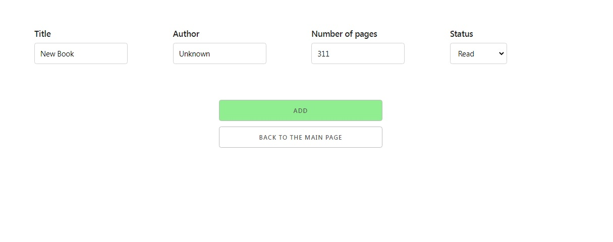
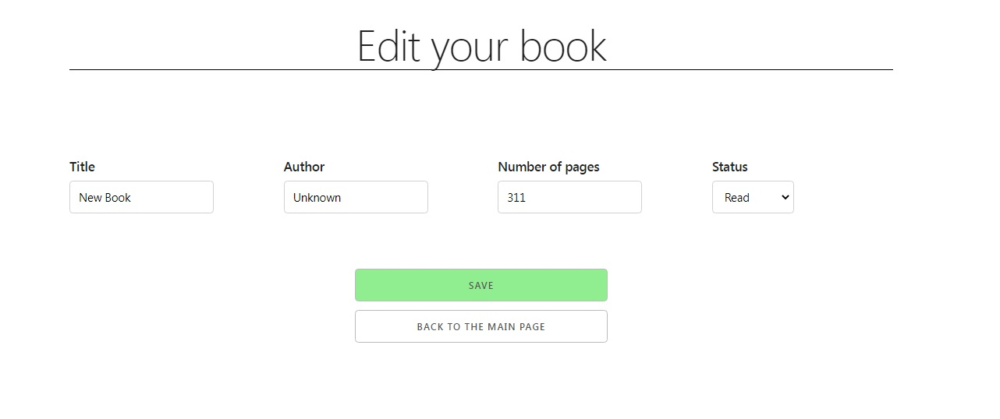
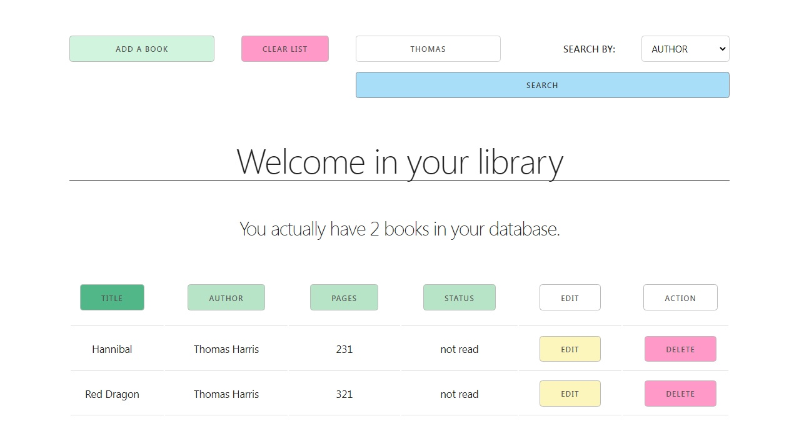
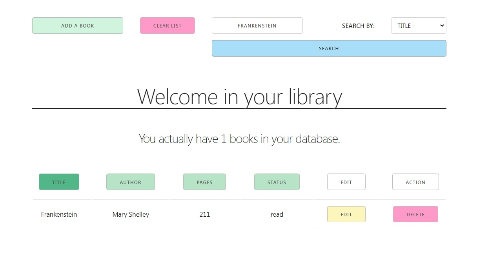
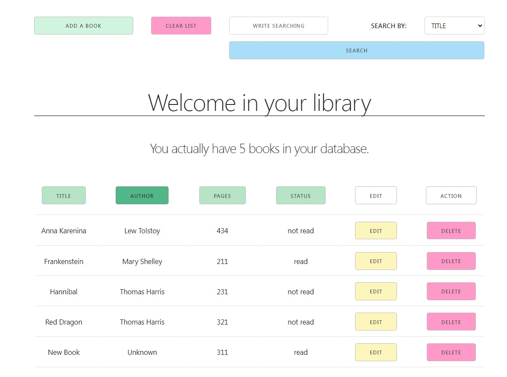

<div align="center">  
  <h1>My library [FE] - v3</h1>
  
# :video_game: <a href="https://library.networkmanager.pl/books">View Demo</a>
###  :link: <a href="https://github.com/RavenPl/MyLibrary-v3-BE">Backend repository</a>
</div>  
<br/>
<br/>

<!-- Table of Contents -->  

# :notebook_with_decorative_cover: Table of Contents

- [About the Project](#star2-about-the-project)
  * [Tech Stack](#space_invader-tech-stack)
  * [Features](#dart-features)
- [Getting Started](#toolbox-getting-started)
  * [Prerequisites](#heavy_exclamation_mark-prerequisites)
  * [Run Locally](#running-run-locally)
- [Usage](#eyes-usage)
- [Project Status](#hammer_and_wrench-project-status)

<br/>

# :star2: About the Project

* a small variation of to do list
* it allows you to add your favourite books

<br/>

# :space_invader: Tech Stack

<details>  
  <summary>Client</summary>  
  <ul>  
    <li>React</li>  
    <li>Typescript</li>
    <li>Skeleton</li>
  </ul>  
</details>  
<details>  
  <summary>Server</summary>  
  <ul>  
    <li>Express</li>  
    <li>Typescript</li>
  </ul>  
</details>  
<details>  
<summary>Security</summary>  
<ul>  
<li>Helmet</li> 
<li>Express Rate Limit</li>
</ul>  
</details>  
<details>  
<summary>Database</summary>  
  <ul>  
    <li>MySQL</li>  
  </ul>  
</details>  

## Technology used

<p align="left">
 &nbsp;&nbsp;&nbsp;&nbsp;
 &nbsp;&nbsp;&nbsp;
 &nbsp;&nbsp;&nbsp;&nbsp;
 &nbsp; &nbsp;&nbsp;&nbsp;
&nbsp;&nbsp;&nbsp;
 &nbsp; &nbsp;&nbsp;&nbsp;
 &nbsp; &nbsp;&nbsp;
&nbsp;&nbsp;&nbsp;
&nbsp;&nbsp;&nbsp;
</p>

<!-- Features -->  

<br/>

# :dart: Features

- general view :heavy_check_mark: <br>
  
- adding a new book to the list :heavy_check_mark: <br>
  
- editing existing ones :heavy_check_mark: <br>
  
- deleting specific one or all at once :heavy_check_mark:
- you can search your book by title or by author name :heavy_check_mark: <br>
   <br> <hr> <br>
  
- you can list your positions by title, author, page number or by status :heavy_check_mark: <br>
  

<br/>

# :toolbox: Getting Started

<!-- Prerequisites -->  

### :heavy_exclamation_mark: Prerequisites

This project uses npm as package manager

```bash  
 npm install --global npm  
```  
<br/>
<!-- Run Locally -->  

# :running: Run Locally

Clone the project

```bash  
 git clone https://github.com/RavenPl/MyLibrary-v3-FE.git
```  

Go to the project directory

```bash  
 cd my-library-FE  
```  

Install dependencies

```bash  
 npm install  
```  

Start the server

```bash  
 npm start  
```  
<br/>
<!-- Usage -->  

# :eyes: Usage

1. Make sure backend is listening and database is implemented correctly, also please check cors settings in express
   repository!

<br/>

# :deciduous_tree: Lessons Learned

<p> :ballot_box_with_check: putting together frontend with backend into working application</p>
<p> :ballot_box_with_check: sharing typescript types between frontend and backend</p>
<p> :ballot_box_with_check: first use of React library</p>
<p> :ballot_box_with_check: using context for common state</p>
<p> :ballot_box_with_check: putting project on proffesional server </p>

<br/>

# :hammer_and_wrench: Project Status

The project is closed.
